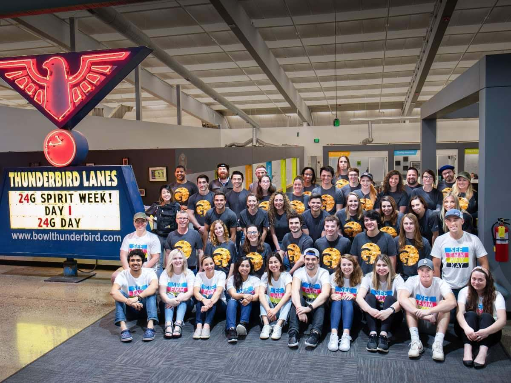

# About Me

## Origins

From a young age, I have taken great interest in technology in various
forms, exploring and learning about all of the many possibilities they
contain.

I experimented with rudimentary web design starting at age seven. When I
was in high school, I took initiative in developing web projects for my
local community (some of which are still in use today).

I attended college at Michigan Technological University, and graduated
with a B.S. in Computer Science (Magna Cum Laude). While there, I was an
active member and student leader in the Humane Interface Design
Enterprise (HIDE) and Sound and Lighting Services (SLS).

---

## Work Experience

### Northland Designs

In this position, I worked closely with a variety of local businesses to
troubleshoot Windows computer system problems, perform IT-related
maintenance and setup tasks, and train users on the use of new software
and hardware.

This position also involved work with network systems, including designing
an office Ethernet network plan and cable management in a large-office
network rack.

### 24G

While at Michigan Tech, I began working in an internship role at 24G,
an agency that worked with many different types of businesses to build
high-quality digital experiences.

In my role, I learned about the real-world processes of web
application development, with a primary focus on frontend.

Through this job I gained working knowledge in JavaScript and Vue.js,
worked individually and in small teams, and traveled onsite with
client-facing experience.

My in-person internship lasted from May-December 2019. After this
point, I continued to work remotely for the company.

In May 2022, I began working full-time for 24G in its Experiential
division.

---

## Other Interests

### Theatre and Live Events

I enjoy working in live environments, with lots of action to handle.
This drew me into working in technical theatre, specifically live sound
and lighting.

In middle and high school, I was an avid participant in handling the tech
side of theatre: making sure mics were distributed, working, and sounding
as good as possible within the constraints of our show’s budget.

I also participated in a touring theatre group my junior and senior year,
requiring quick action and task delegation to continue high-quality
performances with unknown venues and tight timetables.

In college, I have continued working in live events and shows with the
Sound and Lighting Services organization at Michigan Tech.

### Athletics

Throughout high school, I was heavily involved in running, Nordic skiing,
and track. While the sports were individual overall, their team-driven
aspects were greatly motivating for me to keep going and make new bonds.

In college, I have continued running to some degree. However, I have found
a renewed interest in cycling, including heading out to the trails for
some mountain biking.

I’ve also started doing more Alpine skiing in the winter months. While I’d
downhill skied with my family before, I’ve been learning how to safely
tackle greater adventures than can be found at my home hill.

